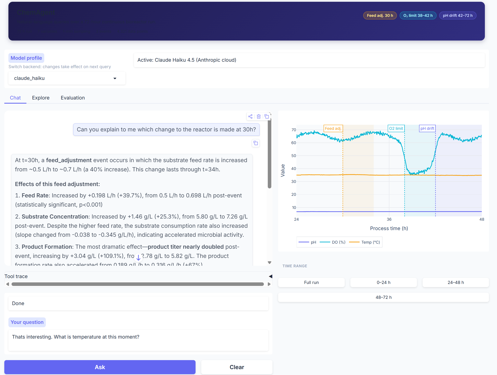
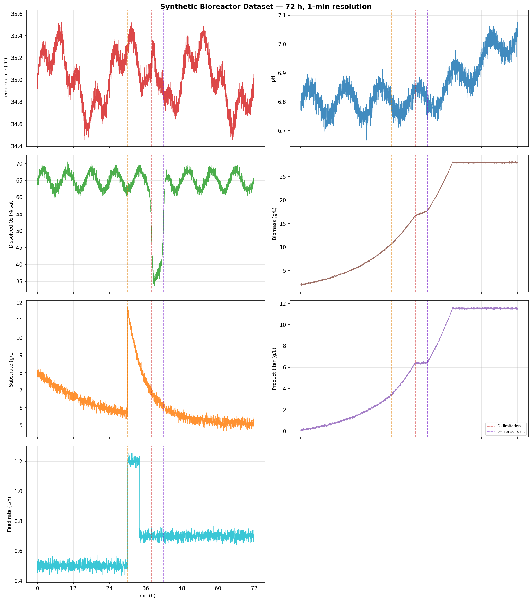

# ChemAgent

ChemAgent answers natural-language questions about a 72-hour continuous bioreactor run. Given a prompt like *"was there evidence of pH drift after 42 h?"*, the agent picks an analytical tool from a small fixed set, runs it against a local time-series CSV, and returns a numerical result with the relevant caveats. It is built on `smolagents` with pluggable LLM backends (Anthropic Claude by default; Ollama and LM Studio supported for local models).



## Install and run

```bash
git clone https://github.com/JaHa25/chemagent
cd chemagent
pip install -r requirements.txt
cp .env.example .env          # then paste your ANTHROPIC_API_KEY
python app.py                 # Gradio UI on http://localhost:7860
```

The CLI is also wired up for quick one-shot queries:

```bash
python -m src.interface.cli "What was the average pH over the last 12 hours?"
```

## Dataset

Synthetic 72-hour fed-batch bioreactor run (seed 42, 1-minute resolution, 4,321 samples). Seven process variables:

| Column | Unit | Description |
|---|---|---|
| `temperature_c` | °C | Reactor temperature (controlled ~35 °C) |
| `ph` | pH | Measured pH (see sensor-fault note below) |
| `do_percent` | % sat. | Dissolved oxygen (setpoint ≥ 60 %) |
| `biomass_gL` | g/L | Biomass concentration (Monod growth) |
| `substrate_gL` | g/L | Carbon substrate |
| `product_titer_gL` | g/L | Accumulated product titer |
| `feed_rate_Lh` | L/h | Substrate feed rate |

Three events are injected with known ground truth so the evaluation suite has unambiguous answers:

| Event | Window | Effect |
|---|---|---|
| Feed adjustment | 30–34 h | Feed step-up; product slope roughly 1.9× steeper |
| O₂ limitation | 38–42 h | DO drops ~31 pp; growth suppressed |
| pH sensor drift | 42–72 h | Measured pH drifts +0.008 pH/h (sensor fault, not a real process change) |

The sensor-drift event is worth flagging: the `ph` column delivered to the agent is the measured signal, so an agent that reports "pH is rising" after 42 h without questioning the sensor is factually correct but diagnostically wrong. The system prompt steers the agent to call this out.

The dataset is generated by `data/generate_data.py`. Authoritative expected values live in `data/ground_truth.md` and are used by both the regex scorer and the LLM-as-judge.



## Architecture

```
User query
    ↓
Chat interface  (Gradio UI  or  CLI)
    ↓
ChemAgent  (smolagents ToolCallingAgent  or  CodeAgent)
    ↓
LiteLLM  →  Anthropic cloud  or  local Ollama / LM Studio endpoint
    ↓
Tool calls  (pandas + scipy over local CSV)
    ├── summary_statistics       mean/min/max for any variable + window
    ├── detect_anomalies         rolling z-score spike detection
    ├── compute_trend            OLS slope + significance test
    ├── compare_pre_post_event   window-pair comparison with % change
    └── plot_variable            returns a Plotly figure
    ↓
Structured answer: numerical result + interpretation
```

The system prompt constrains the agent to the dataset schema, documents the three known events, and includes explicit tool-selection guidance (for example: `detect_anomalies` will not flag slow gradual drift because its rolling baseline tracks it, so diagnosing the pH sensor fault requires `compute_trend`).

## Project layout

```
chemagent/
├── app.py                         Gradio entry point
├── models.yaml                    Model backend profiles
├── pyproject.toml
├── requirements.txt
├── .env.example
│
├── data/
│   ├── bioreactor_timeseries.csv  4,321-row synthetic dataset
│   ├── events.csv                 Operational event metadata
│   ├── ground_truth.md            Authoritative expected answers
│   ├── data_dictionary.md
│   └── generate_data.py           Reproducible dataset generator
│
├── scripts/                       Dev helpers (not imported)
│   ├── compute_truth.py           Recompute ground_truth.md values
│   └── plot_data.py               Static matplotlib overview
│
├── src/
│   ├── config.py                  Env + constants
│   ├── model_registry.py          models.yaml loader + profile resolution
│   ├── agent/
│   │   ├── chem_agent.py          build_agent() dispatches ToolCalling vs CodeAgent
│   │   └── system_prompt.py
│   ├── tools/                     Five analytical tools
│   ├── data/                      CSV loader, column validation
│   └── interface/
│       ├── gradio_app.py
│       ├── cli.py
│       └── chart.py               Plotly figure builder with event bands
│
├── evaluation/
│   ├── run_eval.py                Headless eval runner (8 queries)
│   └── results.md                 Latest run output
│
└── tests/
    └── test_tools_smoke.py        19 pytest smoke tests
```

## Multi-model support

Backend profiles are defined in `models.yaml`. Switch at runtime via:

- **UI**: the model dropdown in the Gradio header
- **CLI**: `CHEMAGENT_PROFILE=local_gemma4_e4b python -m src.interface.cli "..."`
- **Eval**: `python evaluation/run_eval.py --profile local_gemma4_e4b`

| Profile | Backend | Notes |
|---|---|---|
| `claude_haiku` | Anthropic cloud | Default. Requires `ANTHROPIC_API_KEY`. |
| `local_gemma4_e4b` | Ollama `gemma4:e4b` | Requires Ollama running locally |
| `local_gemma_e2b` | Ollama `gemma3:2b` | Lighter fallback |
| `lmstudio_local` | LM Studio | Any loaded model on port 1234 |

Cloud models use `ToolCallingAgent`. Local Ollama and LM Studio profiles automatically fall back to `CodeAgent`, which prompts the model to emit Python code calling the tools rather than relying on native function-calling APIs (smaller open-source models handle the latter unreliably).

## Evaluation

Eight queries spanning three query classes:

| ID | Type | Question |
|---|---|---|
| Q1 | Descriptive | Average pH over last 12 h (must flag sensor drift) |
| Q2 | Descriptive | Max biomass between 20–36 h |
| Q3 | Descriptive | Min DO in first 24 h |
| Q4 | Diagnostic | Temperature anomalies after 24 h |
| Q5 | Diagnostic | DO drop near 38 h |
| Q6 | Diagnostic | pH drift after 42 h (must identify as sensor fault) |
| Q7 | Comparative | Product titer slope before vs after feed adjustment |
| Q8 | Comparative | Substrate change across O₂ limitation event |

Run the suite:

```bash
python evaluation/run_eval.py                          # all 8, default model
python evaluation/run_eval.py --quick                  # Q1+Q2 smoke test
python evaluation/run_eval.py --judge claude_haiku     # LLM-as-judge scoring
python evaluation/run_eval.py --models claude_haiku,local_gemma4_e4b --judge claude_haiku
```

### Results

The system prompt is deliberately free of event-specific hints (no windows, magnitudes, or "the pH sensor drifts after 42 h"). The agent has to discover the events from the data using its tools, which is what the eval is testing.

**Claude Haiku 4.5 (cloud):** 10/11 regex checks pass; LLM-as-judge: 6 correct, 2 partial, 0 incorrect.

| Query | Regex | Judge | Note |
|---|---|---|---|
| Q1 — avg pH last 12 h | 1/2 | partial | Reports correct mean but does not flag sensor drift |
| Q2 — max biomass 20–36 h | 1/1 | correct | |
| Q3 — min DO first 24 h | 1/1 | correct | |
| Q4 — temp anomalies after 24 h | 1/1 | partial | |
| Q5 — DO drop near 38 h | 2/2 | correct | Identifies O₂ limitation event |
| Q6 — pH drift after 42 h | 2/2 | correct | Detects slope and attributes to sensor fault unprompted |
| Q7 — titer change post feed adj. | 1/1 | correct | Reports ~1.8× rate increase |
| Q8 — substrate after O₂ limit | 1/1 | partial | |

**Gemma 4 4B (local, via Ollama + CodeAgent):** 0/8. The 4B model fails to generate syntactically valid tool calls even in CodeAgent mode. It recognises query intent but cannot reliably invoke the tools. This is expected at the 4B parameter scale and illustrates the capability gap between small local models and cloud-scale LLMs for structured tool use. It is kept in the benchmark as an honest point of comparison rather than quietly dropped.

## Running tests

```bash
pytest tests/ -v
```

The smoke tests cover the data loader, all five tools, and ground-truth value checks against known dataset values.

## Local model setup (optional)

To run Ollama profiles:

1. Install Ollama from https://ollama.com/download
2. Pull a model: `ollama pull gemma4:e4b` (about 3.5 GB, fits in 8 GB VRAM)
3. Select the profile in the UI, or pass `--profile local_gemma4_e4b` to the eval runner.

## Requirements

- Python 3.10+
- `ANTHROPIC_API_KEY` for cloud profiles
- Ollama or LM Studio for local profiles (optional)
- See `requirements.txt` for the full package list

## License

MIT. See `LICENSE`.
